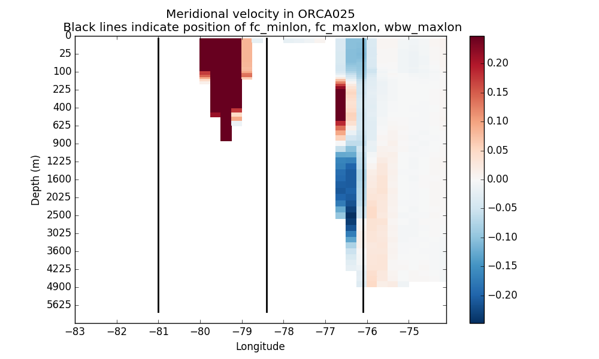
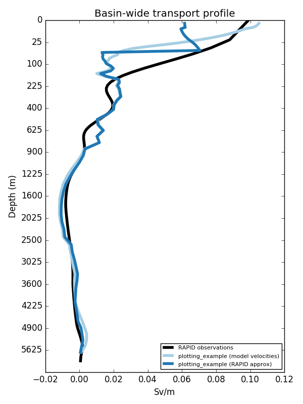
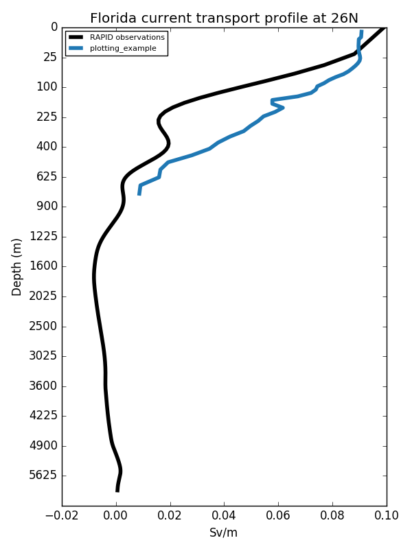
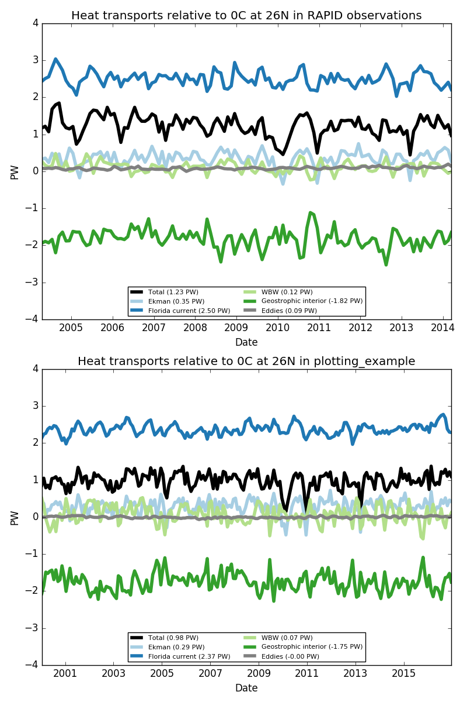
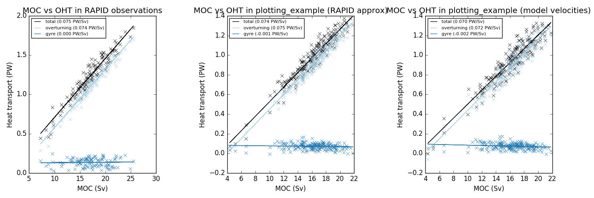
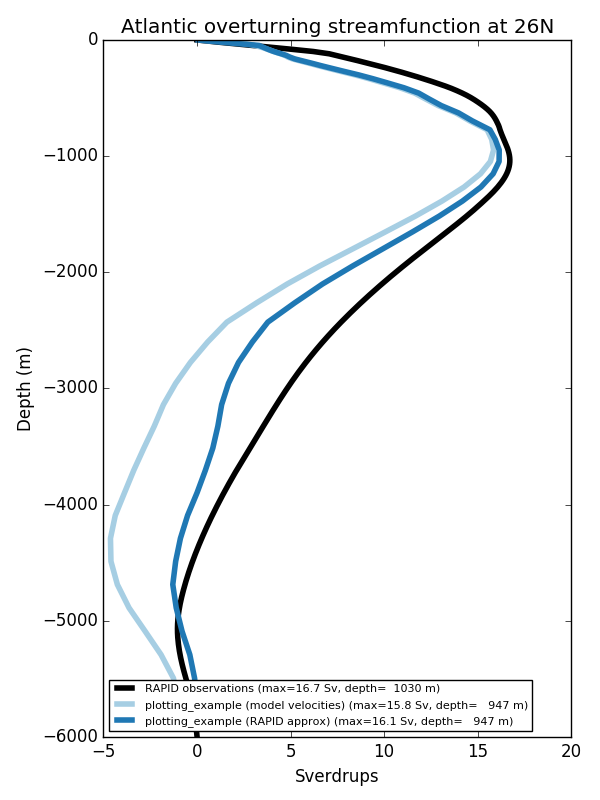
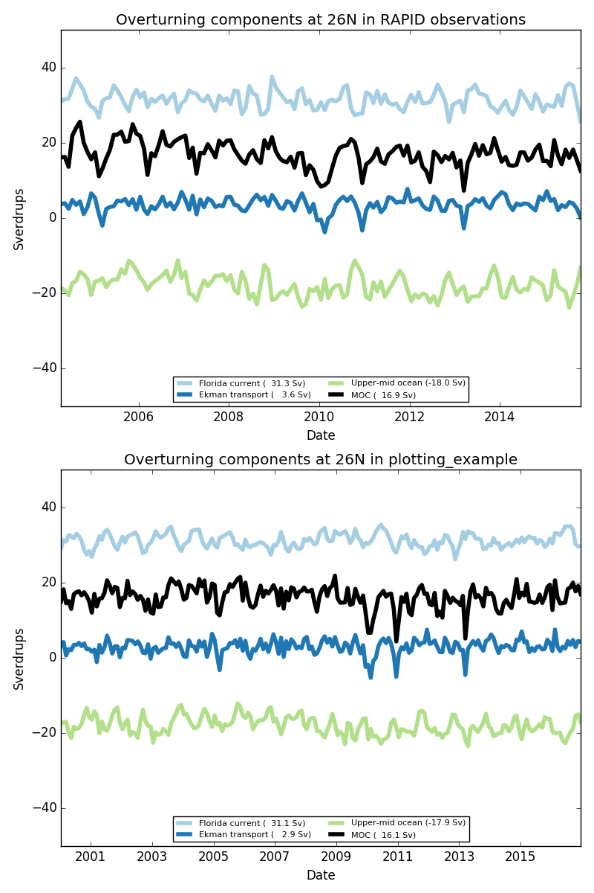
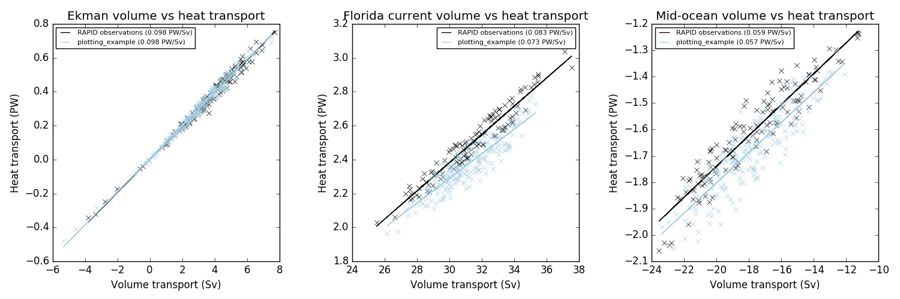
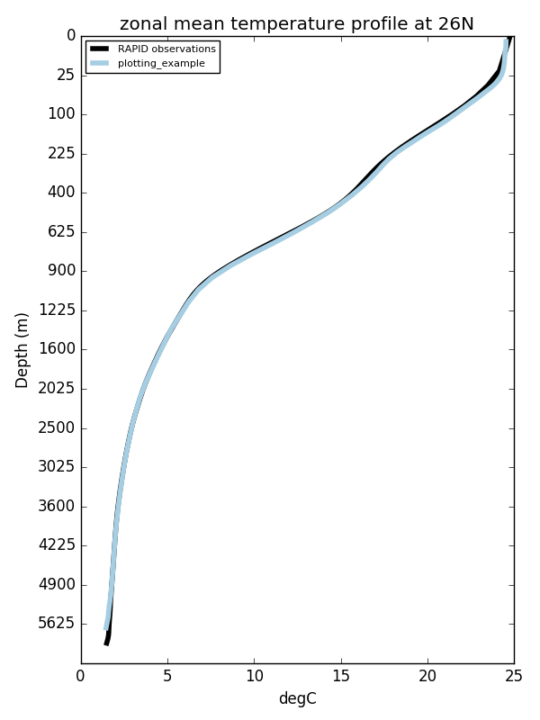

# RapidMoc
This package calculates volume, heat, and freshwater transport diagnostics of the Atlantic meridional overturning circulation (AMOC) using output from ocean general circulation models (including those with curvilinear grids) and plots comparison with observed data from the RAPID-MOCHA array at 26N. Observational data and further details about the RAPID-MOCHA array can be found [here](http://www.rapid.ac.uk/) and [here](https://www.rsmas.miami.edu/users/mocha/mocha_results.htm).

## How to acknowledge this code
If you use RapidMoc in analysis for a journal article, please cite [Roberts et al. (2013)](http://onlinelibrary.wiley.com/doi/10.1002/grl.50930/full), which includes a full description of the methodology.

*Full citation*: Roberts, C. D., et al. (2013), Atmosphere drives recent interannual variability of the Atlantic meridional overturning circulation at 26.5°N, Geophys. Res. Lett., 40, 5164–5170 doi:10.1002/grl.50930.


## Methods and motivation

Since April 2004, the RAPID-MOCHA array at 26N has made continuous observations of the strength and vertical structure of volume and heat transports in the North Atlantic ([Cunningham et al., 2007](http://science.sciencemag.org/content/317/5840/935); [Johns et al., 2011](http://journals.ametsoc.org/doi/abs/10.1175/2010JCLI3997.1)).  To do this, the array combines sub-marine cable measurements of the Florida current, Ekman transports calculated from zonal wind stress, western boundary wedge (WBW) transports measured using current meters, geostrophic transports measured with dynamic height moorings in the ocean interior, and a mass compensation term to ensure that there is zero net transport through the section ([McCarthy et al., 2015](http://www.sciencedirect.com/science/article/pii/S0079661114001694)).

In order to provide the most appropriate comparisons, RapidMoc calculates model transports using an analagous 'RAPID-style' methodology which can be summarized as follows:

* Full-field model velocities are used in the Florida Current and western boundary wedge.
* Meridional Ekman transports are calculated from zonal wind stress.
* Interior geostrophic transports are calculated relative to a specified level of no motion.
* A mass-compensation term is applied as a uniform adjustment to the interior geostrophic velocity field to ensure zero net-flow across the section.
* Heat and temperature transports are calculated following [Johns et al.  (2011)](http://journals.ametsoc.org/doi/abs/10.1175/2010JCLI3997.1).
* Equivalent fresh water transports are calculated following [McDonagh et al. (2015)](http://journals.ametsoc.org/doi/abs/10.1175/JCLI-D-14-00519.1).

The impact of uncertainties in the geostrophic level of no motion is described further by [Roberts et al. (2013)](http://onlinelibrary.wiley.com/doi/10.1002/grl.50930/full).

## Using RapidMoc

### Install package

To install the package, run:

```bash
pip install git+https://github.com/cdr30/RapidMoc.git#egg=RapidMoc
```

### Install manually

#### Required python libraries
RapidMoc was developed using Python 2.7 and requires the installation of the following python libraries and their associated dependencies: `numpy`, `netCDF4`, `ConfigParser`, `argparse`, `os`, `matplotlib`, `abc`, `datetime`, `scipy`, `copy`, and `math`. 


#### Cloning the git repository
To retrieve a copy of the RapidMoc source code and create a working directory, run the following on the command line: 

```> git clone git@github.com:cdr30/RapidMoc.git```

or 

```> git clone https://github.com/cdr30/RapidMoc.git```


#### Running RapidMoc
RapidMoc is invoked from the command line using the `run_rapidmoc.py` script. Running with the `-h` option will return a help message on the required arguments.

```
> ./run_rapidmoc.py -h 
usage: run_rapidmoc.py [-h] config_file tfile sfile taufile vfile

Calculate RAPID AMOC diagnostics using ocean model data

positional arguments:
  config_file  Path to configuration file.
  tfile        Path for netcdf file(s) containing temperature data.
  sfile        Path for netcdf file(s) containing salinity data.
  taufile      Path for netcdf file(s) containing zonal wind stress data.
  vfile        Path for netcdf file(s) containing meridional velocity data.

optional arguments:
  -h, --help   show this help message and exit
```

Netcdf files can be specified using a specific path or a glob pattern as show in the example below:
```
run_rapidmoc.py  config.ini "/path/to/tfiles_????.nc" "/path/to/sfiles_????.nc" "/path/to/taufiles_????.nc" "/path/to/vfiles_????.nc" 
```

*Important*: glob patterns must be surrounded by quotation marks to prevent the shell from expanding them automatically on the command line. 


## Model data
In order to calculate meridional volume, heat and freshwater transports, RapidMoc requires the following ocean variables: temperature (T), salinity (S), across-section velocity  (V), and along-section wind stress (taux). The methods used by RapidMoc are robust across different ocean model grids, but all model data is assumed to be shaped as follows:

```
3D fields (i.e. T, S, V) = (nt,nz,ny,nx)
2D fields (i.e. taux) = (nt,ny,nx)

```
where the x-coordinate is along-section and assumed to be approximately zonal, and the y-coordinate is across-section and assumed to be approximately meridional. Some deviations from this assumption are accounted for when estimating cell bounds and for along-section interpolation of data onto the velocity grid. These operations are designed to work with generalized curvilinear coordinate grids (e.g. the NEMO ORCA grid) and different grid stencils. However, it is assumed throughout the code that sub-sections can be selected using longitude pairs. Extracted sections that do not have an x-coordinate of monotonically increasing longitude data will probably not behave as expected.

## Observational data
To optionally include observational data in plots, include the `[observations]` section in the configuration file. The required data can be downloaded from the RAPID-MOCHA project and NOAA web-pages:

* `mocha_mht_data_*.nc` - a netcdf file containing heat transport data available from the [MOCHA project web site](https://www.rsmas.miami.edu/users/mocha/mocha_results.htm)  

* `moc_vertical_*.nc` and `moc_transports_*.nc` - netcdf files containing volume transports and overturning stream functions available from the [RAPID project web site](http://www.rapid.ac.uk/rapidmoc/rapid_data/datadl.php).

* `FC_cable_transport*.nc` - Florida cable transports can be retrieved and converted to netcdf using `./scripts/get_florida_current_data.ksh`


## Plotting API
The plotting API can be accessed without having to re-run the RapidMoc calculation.  This interface is designed to be used when it necessary to run RapidMoc on multiple "chunks" of data before combining the output into a single netcdf file to create the plots.


```
from netCDF4 import Dataset

import rapidmoc.observations as rapidobs
import rapidmoc.plotdiag as rapidplot

obs_oht = rapidobs.HeatTransportObs(obs_oht_f, time_avg=time_avg, mindt=mindt, maxdt=maxdt)
obs_fc = rapidobs.FloridaCurrentObs(obs_fc_f, time_avg=time_avg)
obs_sf = rapidobs.StreamFunctionObs(obs_sf_f, time_avg=time_avg)
obs_vol = rapidobs.VolumeTransportObs(obs_vol_f, time_avg=time_avg)
trans = Dataset('model_meridional_transports_at_26N.nc')

rapidplot.plot_diagnostics(trans, name='simulated', basename='', 
				      obs_sf=obs_sf, obs_oht=obs_oht,
				      obs_vol=obs_vol, obs_fc=obs_fc)

```

Example plots are included at the end of this document. Time-averaged observations can also be written to netcdf for later analysis.

```
obs.write_to_netcdf(netcdf_file_name)

```

## Configuration files
In order to run RapidMoc, it is necessary to provide a `config.ini` that describes the ocean model data format and specifies options for the RapidMoc calculation. Several example `config.ini` files are provided within the  `etc/` directory. 

#### Specifying longitude bounds of RAPID domains
The RAPID-style calculation requires specification of the longitude bounds for each region. These are specified using the following variables in the `config.ini` file: `fc_minlon`, `fc_maxlon`, `wbw_maxlon` and `int_maxlon`. These values will be model specific and should be chosen using the following criteria:

* The model-analogue to the Florida Current should lie between `fc_minlon` and `fc_maxlon`. If the Straits of Florida are not resolved, then choose these values based on the width of the northward transport contained by the simulated western boundary current. 
* The model-analogues to the northward flowing Antilles Current (centered at ~400m) and southward flowing Deep Western Boundary Current should lie between `fc_maxlon` and `wbw_maxlon`. 
* The geostrophic interior is specified by the region between `wbw_maxlon` and the eastern boundary, `int_maxlon`


#### `plot_rapid_regions.py`
The `plot_rapid_regions.py` is found within the `scripts` directory and is used to visualize the RAPID boundaries on top of meridional velocity data as specified within a particular `config.ini` file. Some example plots showing the tuned RAPID domains for ORCA025 and ORCA1 configurations of the NEMO ocean model are included below.

```
usage: plot_rapid_regions.py [-h] [--name NAME] configf vfile

Plot meridional currents at RAPID section and region boundaries.

positional arguments:
  configf      RapidMoc config file
  vfile        Netcdf file containing meridional velocity data

optional arguments:
  -h, --help   show this help message and exit
  --name NAME  Name to use on plot
```


#### Example plots showing the RAPID regions in different resolution models




#### Annotated example of `config.ini`

```
[temperature/salinity/tau/meridional_velocity]
var = netcdf variable name for temperature/salinity/tau/meridional_velocity data in tfile/sfile/taufile/vfile [string]
xcoord = netcdf variable name for x coordinate in tfile/sfile/taufile/vfile [string]
ycoord = netcdf variable name for y coordinate in tfile/sfile/taufile/vfile [string]
zcoord = netcdf variable name for z coordinate in tfile/sfile/taufile/vfile [string, not required for taufile]
tcoord = netcdf variable name for time in tfile/sfile/taufile/vfile [string]
i1 = minimum index in x coordinate used to extract zonal section from tfile/sfile/taufile/vfile [integer]
i2 = maximum index in x coordinate used to extract zonal section from tfile/sfile/taufile/vfile [integer]
j1 = minimum index in y coordinate used to extract zonal section from tfile/sfile/taufile/vfile [integer]
j2 = maximum index in y coordinate used to extract zonal section from tfile/sfile/taufile/vfile [integer] 
maskf = path to netcdf file containing explicit data mask [string, optional]
maskvar = netcdf variable name for mask in maskf [string, optional]
maskmdi = missing data indicator for maskvar [float, optional]

[observations] 
heat_transports = path to mocha mht data.nc [string, optional]
volume_transports = path to moc transports.nc [string, optional]
streamfunctions = path to moc vertical.nc [string, optional]
florida_current = path to extended florida current transports.nc [string, optional]
time_avg = monthly or yearly [string, optional]

[options]
georef_level = depth used as geostrophic level of no motion [float]
ekman_depth = depth used as bottom of ekman layer [float]
ek_profile_type = determines how ekman transports are distributed over the Ekman layer. [string, 'uniform' or 'linear']
fc_minlon = longitude corresponding to western boundary of simulated florida current [float, -180 to 180]
fc_maxlon = longitude corresponding to boundary between simulated florida current and the western boundary wedge containing the simulated deep western boundary current [float, -180 to 180]
wbw_maxlon = longitude corresponding to boundary between the western boundary wedge containing the simulated deep western boundary current and the geostrophic interior [float, -180 to 180]
int_maxlon = longitude corresponding to eastern boundary of geostrophic interior [float, -180 to 180]
reference_salinity = reference salinity used in calculation of equivalent freshwater transports.

[output]
date_format = format string used with datetime.strftime, e.g. '%Y%m%d' [string]
name = descriptive string used to describe model experiment [string]
plot = boolean used to enable/disable plotting [boolean] 
outdir = path to output directory where data/plots are saved [string]
```

Note that it is possible to specify a range of indices in the y-direction. If `j1 != j2`, then data is extracted over a range of j-indices and then averaged to create a single zonal section. This allows temperature and salinity to be averaged onto the velocity section in a way that respects the staggering of the original model grid. 

## Example plots










